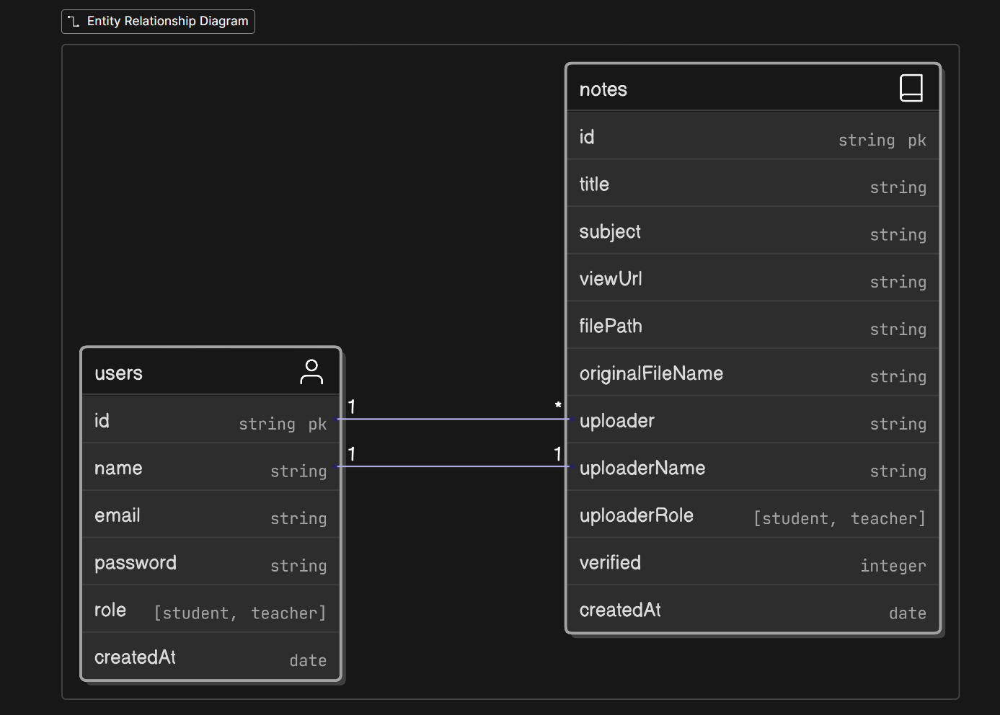

### API Endpoints

- `POST /api/auth/register`: Create a new user.

- `POST /api/auth/login`: Log in a user and get a JWT.

- `GET /api/notes`: Get all notes (with pagination, search, sort, filter).

- `GET /api/notes?role=teacher`: Get only teacher-verified notes.

- `POST /api/notes/upload`: (Protected) Upload a new note file.

- `GET /api/notes/download/:id`: Download a specific note file by its ID.

`id`: Will be provided by MongoDB

### Database Model

